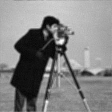

## Bayesian Image Restoration using Unadjusted Langevin Algorithm (ULA)

This project implements an image restoration method (deblurring / denoising) based on the **Unadjusted Langevin Algorithm**, using the DeepInverse library.  
The approach combines inverse physical models with deep denoisers acting as priors.

<p align="left">
  
  
</p>


## Installation

1. Clone the repository :
   ```bash
   git clone https://github.com/alexandre-martel/Bayesian-imaging-PnP-ULA-algorithm.git
   cd Bayesian-imaging-PnP-ULA-algorithm
   ```

2. Install the dependencies :
    ```bash
    pip install torch torchvision numpy matplotlib pillow deepinv
    ```

## Usage

### Run the main restoration test

To run the restoration on the test image (camera_man.jpg) :
    ```bash
    python test.py
    ```

### Independent metric computation

A script is provided to compute PSNR and SSIM between two saved images:
    ```bash
    python src/calculate_metrics.py -path1 "data/original.png" -path2 --path-to-img-2
    ```

## Parameter Configuration

The performance of the algorithm strongly depends on the tuning of the hyperparameters stored in the dictionary `algo_params_default` :

### 1. Choice of the Denoiser
* **DRUNet** : Very effective for complex blur (we didn't succeed to calibrate it well)
    * `burn_in` recommended : ~100.
    * `n_iter` recommended : ~500.
* **DnCNN** : Faster per iteration but often requires more steps.
    * `burn_in` recommended : ~1000.
    * `n_iter` recommended : ~6000.

### 2. Physical and Convergence Parameters
* **sigma_destruction** : Defines the noise level introduced by the physical model (ex: 1/255**2).
* **denoiser_param** : Strength of the denoising prior. For DRUNet, a value around 25/255 is a good starting point.
* **delta (Step size)** : The step size is automatically computed using the Lipschitz constant of the physics ($L_y$) :

$$\delta = \frac{0.5}{\frac{L}{\text{denoiser\_param}} + L_y}$$

## Algorithm and Equations

The Langevin sampling implemented follows the update rule:

$$x_{k+1} = x_k - \delta \nabla \log p(y|x_k) - \delta \nabla \log p(x_k) + \sqrt{2\delta} \epsilon$$

Where :
* $\nabla \log p(y|x_k)$ is the gradient of the data fidelity term (provided by the `physics` operator)
* $\nabla \log p(x_k)$ is approximated using the score induced by the chosen denoiser.
* $\epsilon \sim \mathcal{N}(0, I)$ is Gaussian noise injected to explore the posterior distribution.

The final restored image is obtained by averaging the samples after the burn-in period in order to reduce variance.